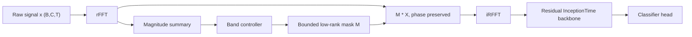
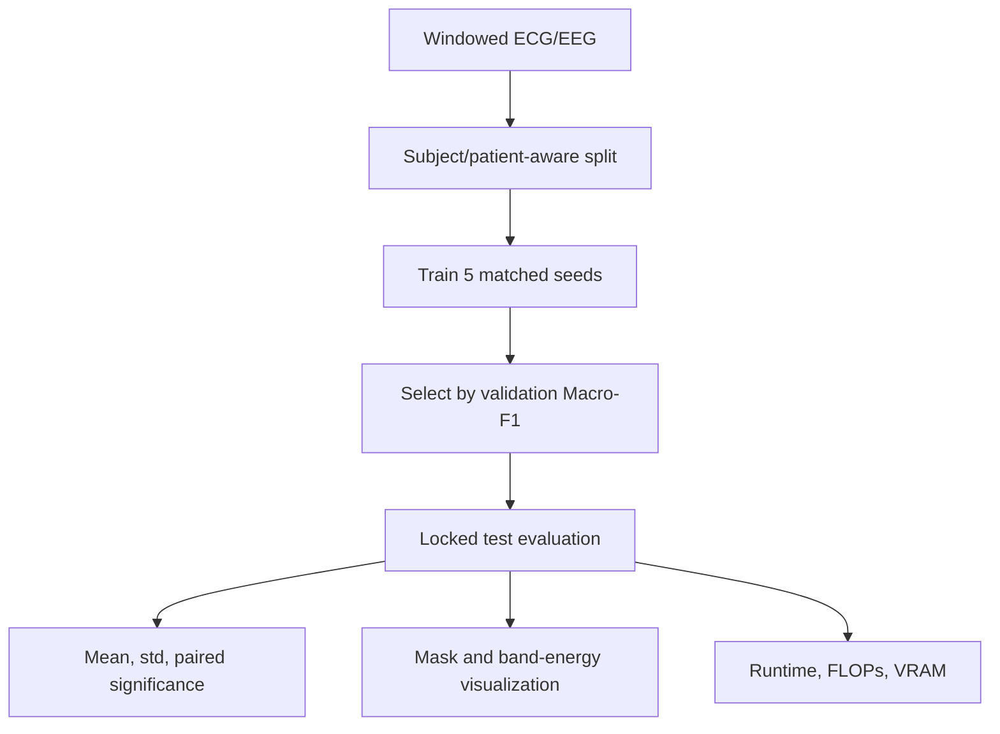

# Phase-Decoupled Spectral Inception

## Title And Core Novelty Claim

**Title:** Phase-Decoupled Spectral Inception: Bounded Amplitude Interventions for Efficient Biomedical Time-Series Classification

**Core novelty claim:** PDSI is a lightweight, sample-adaptive, phase-preserving spectral intervention layer for biomedical time-series classification. Unlike latent spectral architectures that replace the backbone, PDSI applies a bounded low-rank mask to input Fourier amplitudes, exactly preserves phase, reconstructs the signal, and then uses a standard InceptionTime-style temporal classifier. The paper's central claim should be narrow: phase-preserving amplitude intervention gives a better accuracy, stability, and interpretability tradeoff than no spectral bias, fixed DSP filtering, or unconstrained complex spectral gating under matched compute.

## Abstract

Biomedical time-series classifiers must detect morphology and oscillatory structure under strict data, compute, and interpretability constraints. Convolutional models such as InceptionTime provide strong local temporal features, but frequency-selective behavior is learned only implicitly through stacked filters. We propose Phase-Decoupled Spectral Inception (PDSI), a compact input-level module that performs a real Fourier transform, predicts a bounded low-rank mask over spectral amplitudes, preserves Fourier phase, reconstructs the filtered signal, and passes it to an otherwise unchanged temporal backbone. This construction yields an explicit spectral inductive bias while retaining the morphology-sensitive advantages of time-domain convolution. We give a stability result showing that the gate is identity-initialized, phase-preserving, and Lipschitz bounded by the learned mask range. We evaluate PDSI on ECG and EEG classification benchmarks with five matched seeds, strong convolutional and spectral baselines, causal ablations against complex gating and fixed Butterworth filtering, runtime profiling, and mask visualizations. The intended publishable result is not universal state of the art, but a reproducible demonstration that a small phase-preserving spectral intervention improves class-sensitive metrics at near-baseline training cost.

## Introduction And Motivation

Physiological signals mix two kinds of evidence: time-local morphology such as QRS complexes or seizure transients, and frequency-structured evidence such as sleep rhythms, seizure-band energy, baseline drift, muscle noise, and line-noise artifacts. Modern temporal CNNs are good at the first kind and can approximate the second, but they must learn spectral filtering indirectly.

The base idea, a spectral gate before InceptionTime, is scientifically plausible but too incremental if implemented as a static mask. The strengthened project makes three changes:

1. The mask is **sample-adaptive** through a tiny controller over spectral-band summaries.
2. The mask is **low-rank and smooth**, using RBF frequency atoms rather than a free parameter per Fourier bin.
3. The intervention is **phase-preserving and bounded**, enabling clear stability and interpretability claims.

Hypotheses:

- H1: A bounded amplitude-only spectral intervention improves Macro-F1 or balanced accuracy on at least one ECG or EEG benchmark without material regression on others.
- H2: Phase preservation is empirically preferable to unconstrained complex gating under matched parameter and runtime budgets.
- H3: Learned masks are non-flat, seed-stable, and clinically plausible enough to provide mechanistic evidence rather than post-hoc decoration.
- H4: The FFT overhead is small relative to the convolutional backbone, keeping five-seed PDSI training under one hour on one AMD MI300X for the core experiment.

## Related Work Positioning

**Time-series CNNs.** InceptionTime is an efficient and strong time-series classification reference that combines multi-scale convolution and residual learning, but it learns frequency selectivity through time-domain kernels. PDSI keeps this backbone and adds only a front-end spectral intervention, so improvements are attributable to the gate rather than a wholesale architecture change.

**Fast TSC baselines.** MiniRocket, ROCKET-style transforms, and Hydra are strong fast baselines for time-series classification. They are essential reviewer-facing comparisons because a small biomedical model must justify itself against fast non-deep methods, not only neural baselines.

**Frequency-domain time-series models.** TimesNet uses adaptive period discovery and 2D temporal variation modeling; TSLANet uses adaptive spectral blocks and interactive convolutions for broad time-series representation learning. PDSI differs by being an input-level, phase-preserving, bounded amplitude intervention whose purpose is not to replace the backbone but to test a causal spectral bias in biomedical classifiers.

**DSP and spectrogram pipelines.** Fixed bandpass, notch, and spectrogram-CNN pipelines motivate the inductive bias but are not task-adaptive and often obscure whether gains come from denoising, amplitude selection, or phase/morphology distortion. PDSI directly tests learned amplitude selection while reconstructing the original time-domain signal.

**Fourier neural operators and spectral convolutions.** FNO-style layers learn complex spectral mixing for operator learning. PDSI is much smaller and targets classification; its main constraint is exactly the part FNO-like layers relax: it avoids arbitrary phase changes.

## Method

### Model Architecture

Input `x in R^(B x C x T)` goes through:

1. Real FFT along time: `X = rFFT(x)`.
2. Magnitude summary: `A = |X|`, `z_k = <log(1 + mean_c A_c), phi_k>`.
3. Tiny controller: `alpha = MLP(z)`.
4. Low-rank mask:

```text
M_b,c,f = 1 + delta_max * tanh(sum_k (alpha_b,k + beta_c,k) phi_k(f))
```

where `phi_k` are fixed smooth RBF frequency atoms and `beta_c,k` are channel offsets.

5. Phase-preserving reconstruction:

```text
x_gated = iRFFT(M * X)
```

6. InceptionTime-style residual backbone with parallel 1D kernels `[9, 19, 39]`, bottleneck convolutions, max-pool branch, global average pooling, and linear head.

The implemented default is approximately **227K trainable parameters** for PTB-XL superclass classification with 12 channels, sequence length 1000, depth 4, 24 branch channels, 32 bottleneck channels, 16 spectral bands, and 5 output labels. The adaptive gate adds roughly **1.3K parameters**.

### Mathematical Objective

For dataset `D = {(x_i, y_i)}`, classifier `f_theta`, spectral gate `g_phi`, and task loss `ell`, optimize:

```text
min_{theta, phi}  1/N sum_i ell(f_theta(g_phi(x_i)), y_i)
                + lambda_id E[||M_phi(x_i) - 1||_2^2]
                + lambda_tv E[sum_f |M_phi(x_i)_{f+1} - M_phi(x_i)_f|].
```

For PTB-XL multilabel classification use BCE-with-logits. For single-label CHB-MIT and Sleep-EDF windows use cross-entropy.

### Proposition 1: Phase Preservation And Stability

Let `F` be an orthonormal real Fourier transform and `D_M` a diagonal real mask with `0 < a <= M_k <= b`. The PDSI gate `G_M(x) = F^{-1} D_M F x` satisfies:

```text
||G_M x||_2 <= b ||x||_2
||G_M x - G_N x||_2 <= ||M - N||_infty ||x||_2.
```

For every nonzero Fourier coefficient `X_k`, `arg(M_k X_k) = arg(X_k)` because `M_k` is positive and real. Thus PDSI can suppress or amplify spectral energy without introducing arbitrary phase shifts. Identity initialization follows from zero-initializing the controller's final layer and channel offsets, giving `M = 1` at step 0.

### Training Algorithm

```text
for seed in {0,1,2,3,4}:
    set deterministic split and model seed
    initialize PDSI mask to identity
    for epoch in 1..E:
        for minibatch (x, y):
            X = rFFT(x)
            M = bounded_low_rank_mask(|X|)
            x_gated = iRFFT(M * X)
            logits = InceptionTime(x_gated)
            loss = task_loss(logits, y) + id_penalty(M) + tv_penalty(M)
            update with AdamW and mixed precision
        select checkpoint by validation Macro-F1
    report test metrics, runtime, memory, and learned mask summaries
```

## Computational Complexity

For batch size `B`, channels `C`, length `T`, spectral bins `F = T/2 + 1`, and bands `K`:

- Gate FFT cost: `O(B C T log T)`.
- Mask controller: `O(B C K F + B K^2)`, small for `K=16`.
- Backbone convolution: `O(B T sum_l sum_j C_l C'_l k_j)`.
- Memory: activations dominate. Parameters are <1 MB in fp32 for the default model; training activations are expected to remain well below 10 GB for batch 256 and `T=1000`.
- Estimated forward FLOPs per sample for default PTB-XL setting: about 0.45 GFLOPs for convolutions plus about 0.001 GFLOPs for FFT operations. FFT overhead should be <1 percent of total forward FLOPs.
- Expected MI300X wall-clock: PTB-XL 5-seed PDSI core, 20 epochs with early stopping, batch 256, bf16 autocast: 20-35 minutes after preprocessing. CHB-MIT window classification: 15-25 minutes depending on window density. The full paper matrix with all external baselines may exceed one hour; the one-hour constraint is realistic for the proposed model and core ablations, not for exhaustive third-party baseline reproduction.

## Experimental Design

### Datasets

Primary:

- **PTB-XL:** 21,837 clinical 12-lead ECG records from 18,885 patients, 10 seconds each, multilabel diagnostic superclass and subclass tasks.
- **CHB-MIT:** pediatric scalp EEG seizure detection, using subject-aware splits and fixed windows around annotated seizure intervals.

Required third benchmark for main-conference submission:

- **Sleep-EDF Expanded:** sleep-stage classification from EEG/EOG/EMG windows. This is important because sleep staging has canonical spectral-band structure and gives reviewers an interpretable EEG benchmark distinct from seizure detection.

Two datasets are enough for an internal feasibility report, but not ideal for a NeurIPS main submission. The final paper should use PTB-XL, CHB-MIT, and Sleep-EDF unless CHB-MIT preprocessing or labeling proves unreliable. If time allows, add one non-biomedical UEA/UCR dataset as an out-of-domain sanity check, but do not let it displace the three biomedical benchmarks.

### Baselines

Core matched baselines:

- InceptionTime-style backbone without a gate.
- PDSI adaptive phase-preserving gate.
- Naive complex spectral gate, same backbone.
- Fixed Butterworth-style spectral bandpass plus same backbone.
- FCN and ResNet1D neural time-series classifiers, implemented in the same training stack.
- FCN+PDSI and ResNet1D+PDSI portability checks.

Strong reviewer-facing baselines:

- MiniRocket or MultiRocket with ridge/logistic classifier.
- Hydra.
- TSLANet compact classification setting.
- TimesNet compact classification setting.
- A small PatchTST/Transformer classifier only if it fits the compute budget cleanly.

For submission, the minimum acceptable baseline set is InceptionTime, FCN, ResNet1D, MiniRocket or MultiRocket, Hydra, TSLANet, PDSI, and the PDSI controlled ablations. TimesNet and PatchTST are highly recommended if runtime permits.

### Metrics

- Primary: Macro-F1 and balanced accuracy.
- Secondary: AUROC, AUPRC, calibration error if time allows.
- Efficiency: parameter count, forward FLOPs, peak VRAM, epoch time, total wall-clock.
- Statistics: five matched seeds, mean +/- std, paired sign-flip test or paired t-test for PDSI vs baseline.

### Ablations

- Static global mask vs sample-adaptive mask.
- Free per-frequency mask vs low-rank RBF mask.
- Magnitude-only PDSI vs complex phase-altering gate.
- No regularization vs identity penalty vs TV penalty.
- Number of spectral bands `K in {4, 8, 16, 32}`.
- Mask range `delta_max in {0.25, 0.5, 0.75}`.
- Low-label PTB-XL supervised subsets `{10%, 25%, 100%}`.

### Hyperparameter Selection

A large test-set-driven sweep is not needed and would undermine the compute-constrained claim. A small validation-only sweep is needed for credibility:

- `num_bands in {8, 16, 32}`
- `max_delta in {0.25, 0.5, 0.75}`
- `lambda_tv in {0, 1e-4}`

Run this sweep on one seed using the validation set only. Freeze the selected setting before the five-seed test runs. Report the selected hyperparameters and the full sweep grid in the appendix. If reviewers ask why the sweep is small, the answer is that PDSI is meant to be a low-tuning inductive bias rather than a heavily searched architecture.

### Robustness And Sensitivity

- Additive high-frequency noise.
- Baseline wander.
- Random temporal jitter.
- Channel dropout for EEG.
- Sensitivity to sequence length and sampling rate normalization.

## Figures And Tables

### Figure 1: Architecture



### Figure 2: Training And Inference Pipeline



### Main Results Table

| Dataset | Method | Macro-F1 | Balanced Acc. | AUROC | AUPRC | Time/epoch | Params |
|---|---:|---:|---:|---:|---:|---:|---:|
| PTB-XL superclass | InceptionTime | TBD | TBD | TBD | TBD | TBD | TBD |
| PTB-XL superclass | FCN | TBD | TBD | TBD | TBD | TBD | TBD |
| PTB-XL superclass | ResNet1D | TBD | TBD | TBD | TBD | TBD | TBD |
| PTB-XL superclass | MiniRocket/Hydra | TBD | TBD | TBD | TBD | TBD | TBD |
| PTB-XL superclass | TSLANet | TBD | TBD | TBD | TBD | TBD | TBD |
| PTB-XL superclass | PDSI | TBD | TBD | TBD | TBD | TBD | TBD |
| CHB-MIT | InceptionTime | TBD | TBD | TBD | TBD | TBD | TBD |
| CHB-MIT | PDSI | TBD | TBD | TBD | TBD | TBD | TBD |
| Sleep-EDF | InceptionTime | TBD | TBD | TBD | TBD | TBD | TBD |
| Sleep-EDF | PDSI | TBD | TBD | TBD | TBD | TBD | TBD |

### Ablation Table

| Variant | Phase preserved | Adaptive | Low-rank | Macro-F1 delta | Runtime ratio |
|---|---:|---:|---:|---:|---:|
| Fixed Butterworth | yes | no | no | TBD | TBD |
| Complex gate | no | yes | no | TBD | TBD |
| Static amplitude mask | yes | no | yes | TBD | TBD |
| PDSI | yes | yes | yes | TBD | TBD |

### Scaling Plot

Plot sequence length `T` on x-axis and wall-clock per epoch / forward FLOPs on y-axis for baseline, PDSI, and complex gate. Expect PDSI and complex gates to show `T log T` overhead but remain dominated by convolution.

### Mechanism Figure

Overlay average learned masks across seeds with canonical EEG/ECG frequency bands or noise bands. Include confidence bands across seeds and compare to fixed Butterworth.

## NeurIPS Submission Components

### Contributions

1. A bounded sample-adaptive phase-preserving spectral gate for biomedical time-series classification.
2. A stability and phase-preservation analysis showing identity initialization and controlled input perturbation.
3. A compute-bounded empirical protocol with matched five-seed comparisons, causal spectral ablations, runtime profiling, and mask visualizations.
4. Evidence, if experiments support it, that amplitude-only spectral intervention is a better efficiency and interpretability tradeoff than unconstrained complex gating.

### Reproducibility Checklist Alignment

- Release code for model, training, configs, metrics, and profiling.
- Report exact dataset splits, preprocessing, sampling rates, window lengths, and label construction.
- Report all hyperparameters and seed lists.
- Report mean, std, and paired significance across five seeds.
- Report compute: GPU type, VRAM, precision, training time, parameters, and FLOPs.
- Document data licenses and access restrictions for PhysioNet and PTB-XL.
- Include limitations and broader impacts in the main paper or appendix.

### Limitations

- The method may help only when discriminative information is meaningfully frequency-structured.
- Phase preservation is a constraint, not a universal virtue; some tasks may benefit from phase manipulation.
- Biomedical benchmark preprocessing can dominate results, so leakage-free patient or subject splits are mandatory.
- The proposal is not a foundation model and should not claim broad time-series dominance.
- If gains are below 1 percentage point or not seed-stable, the work is likely too incremental for NeurIPS main.

### Broader Impacts And Ethics

This is decision-support research, not a clinical diagnostic system. Risks include overclaiming clinical utility, hidden dataset bias, and poor generalization across devices, populations, and acquisition protocols. The paper should avoid deployment claims, document demographic and patient-split limitations where metadata permit, and frame learned masks as model evidence rather than medical explanations. PhysioNet and PTB-XL licensing and citation requirements must be followed.

## Expected Reviewer Concerns And Rebuttal Strategy

**Concern: This is just a Fourier filter before a CNN.**  
Rebuttal requires showing that the adaptive, bounded, phase-preserving, low-rank formulation outperforms fixed filters and complex gates, with a stability proposition and interpretable masks.

**Concern: Too close to TSLANet or TimesNet.**  
The paper must emphasize that those are broader latent representation architectures, while PDSI is a minimal input-level intervention designed to isolate amplitude gating while preserving morphology-sensitive phase.

**Concern: Biomedical-only results are narrow.**  
Add one non-biomedical UEA/UCR control or Sleep-EDF if time permits, but do not dilute the main story. NeurIPS accepts domain-grounded ML when the method and evaluation are clean.

**Concern: Gains are small.**  
Small gains are defensible only if they are statistically consistent, compute-cheap, and mechanistically explained. Otherwise pivot to a stronger gate or do not submit to main.

**Concern: Data leakage.**  
Use official PTB-XL folds, subject/patient-aware splits for EEG, no overlapping windows across train/test subjects, and release split manifests.

## Paper Outline For An 8-Page NeurIPS Draft

1. **Introduction, 0.9 pages:** problem, hypothesis, concise contributions.
2. **Background and related work, 1.0 page:** InceptionTime, fast TSC, spectral models, DSP biomedical filters.
3. **Method, 1.7 pages:** architecture, equations, regularization, algorithm.
4. **Theory and complexity, 0.8 pages:** phase preservation, stability, FLOPs, memory.
5. **Experimental setup, 1.1 pages:** datasets, splits, metrics, baselines, seeds.
6. **Results, 1.4 pages:** main table, significance, efficiency, scaling plot.
7. **Ablations and interpretation, 0.8 pages:** phase gate, fixed filter, low-rank/adaptive, masks.
8. **Limitations, broader impacts, conclusion, 0.3 pages.**

NeurIPS 2026 currently allows nine content pages in the main text, but an 8-page target keeps the story disciplined.

## Skeptical Reviewer Evaluation

**Estimated acceptance probability today:** 12-18 percent before real results, because the idea is elegant but close to existing spectral time-series work.

**Estimated acceptance probability if the planned experiments succeed:** 22-30 percent if PDSI gives statistically significant gains on PTB-XL and CHB-MIT, holds runtime below 1.2x baseline, and beats fixed/complex gate ablations.

**Main weaknesses:**

- Novelty may be judged architectural and modest.
- Strong baselines such as TSLANet/Hydra must be implemented carefully or reviewers will discount the results.
- Biomedical preprocessing choices can overwhelm model differences.
- A one-hour compute budget limits extensive hyperparameter tuning and broad benchmarking.

**How to raise it toward stronger accept territory:**

- Add a genuinely diagnostic result: phase-preserving PDSI beats complex gating because complex gating overfits or destabilizes under jitter.
- Show a mask stability analysis across seeds and subjects, not only a pretty average mask.
- Include one cross-dataset transfer or low-label result where the spectral prior matters more than raw capacity.
- Release split manifests and preprocessing scripts to remove leakage doubts.
- Tighten theory with a generalization-style argument for low-rank spectral masks or a certified bound on corruption sensitivity.

## Sources Consulted

- NeurIPS 2026 Call for Papers and Main Track Handbook: https://neurips.cc/Conferences/2026/CallForPapers and https://neurips.cc/Conferences/2026/MainTrackHandbook
- NeurIPS checklist guidance: https://nips.cc/public/guides/PaperChecklist
- InceptionTime: https://doi.org/10.1007/s10618-020-00710-y
- TSLANet, ICML 2024: https://proceedings.mlr.press/v235/eldele24a.html
- TimesNet, ICLR 2023: https://openreview.net/forum?id=ju_Uqw384Oq
- Hydra: https://doi.org/10.1007/s10618-023-00939-3
- PTB-XL dataset: https://doi.org/10.1038/s41597-020-0495-6
- CHB-MIT PhysioNet: https://physionet.org/content/chbmit/
- Sleep-EDF Expanded PhysioNet: https://physionet.org/content/sleep-edfx/
